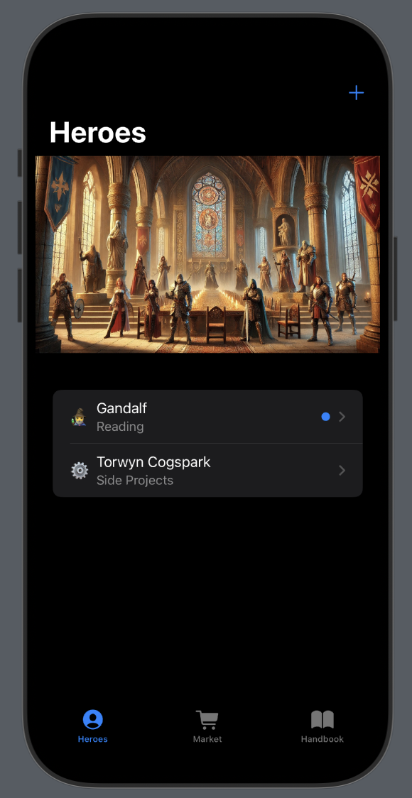

#AI Quest Habit Tracker
## How It Started
This habit tracker has been a passion project of mine for the last few months. It’s a medieval fantasy-themed habit tracker designed to gamify my habits and systems-building.
It all began as a simple **pen-and-paper** D&D-style character sheet that I managed manually. Later, I moved it into my Obsidian notebook, using task queries for easier quest management. Eventually, I got tired of manually asking ChatGPT to generate quests and updating my character sheet, and then a lightbulb moment hit me:
> *"This is a perfect use case for an app!"*

## How It Works
In this world, each **character** represents a **habit**. They have a motivation and backstory shaped by the habit itself.
Characters can embark on **quests**, earning experience and loot along the way. These rewards can then be spent in the Marketplace to purchase real-life rewards — a fun way to reinforce progress and stay motivated.



## How It Was Made
Why did I choose Swift and iOS? Honestly, I have no idea. I had barely programmed in Swift before. In retrospect, using a stack I was more familiar with would have been easier, but I learned a lot along the way.
The architecture is fairly straightforward, heavily inspired by the Apple Developer Tutorials.

**SwiftUI** – A modern declarative framework for building iOS apps
**SwiftData** – A local SQLite database that runs on-device
**Google Gemini** – An LLM used to generate JSON for characters and quests
**Ollama (optional)** – If your computer can run a local LLM like **Llama 3.2** (confirmed with M1 Mac), you can use Ollama for various queries with reasonable success

All assets and images were generated using Gemini.

## Usage
BYOK (Bring Your Own Key):
1. Generate a Gemini API key through Google AI Studio.
2. In the AIQuest directory, create a new configuration file named Config.xcconfig.
3. Add the following line to the file:
```xcconfig
GEMINI_API_KEY=<YOUR API KEY HERE>
```
